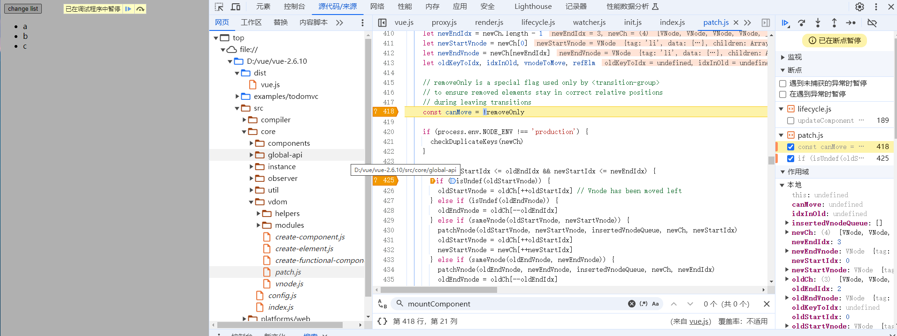

this._init(options)
updateComponent

[vue-2.6.10/src/core/vdom/patch.js](file:///D:/vue/vue-2.6.10/src/core/vdom/patch.js)
patch
patchVnode
updateChildren
patch->patchVnode->updateChildren

-----------
file:///D:/vue/vue-2.6.10/src/core/instance/lifecycle.js
mountComponent
updateComponent = () => {
      vm._update(vm._render(), hydrating)
    }

lifecycleMixin
callHook(vm, 'mounted')

debugger
---------
oldStartVnode.tag=='li' 418
oldStartVnode.tag=='li' 425

